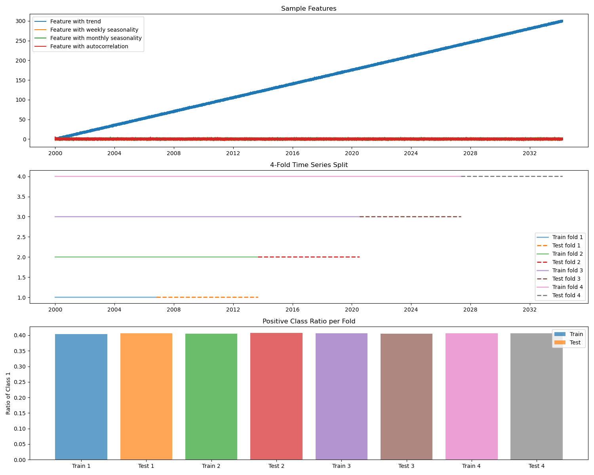
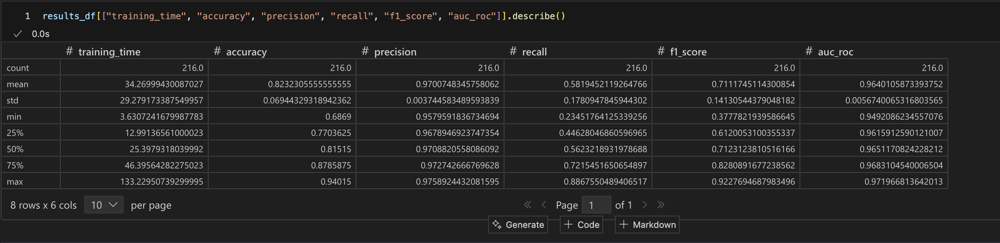

# Testbed for Spark and `lightgbm`

This repository serves as a testbed for integrating Apache Spark with `lightgbm` for distributed machine learning tasks. It includes synthetic data generation, model training, and evaluation using LightGBM classifiers in a Spark environment.

## Environment Setup

* Hardware platform: MacBook Pro M4 Chip with 48GB RAM, 16 CPU cores, 1TB SSD
* Operating System: macOS  Sequoia 15.4.1
* Docker Desktop: 4.41.1

The testbed runtime is composed of set of Docker contatiners with two main components:
1. **Standalone Apache Spark Cluster**: A distributed computing framework that allows for parallel processing of large datasets. It is set up in standalone mode, with a master node and multiple worker nodes.
2. **Jupyterlab Notebook Server**: A web-based interactive computing environment that allows users to create and share documents containing live code, equations, visualizations, and narrative text. 

**Environment design**:


The environment is defined using `docker-compose`, which simplifies the process of managing multi-container Docker applications. The `docker-compose.yml` file specifies the configuration for the Spark cluster and Jupyterlab server, including the number of worker nodes, resource allocation, and network settings.

To bring up the environment, run the following command:

```bash
docker-compose up -d
```
This command will start the Spark cluster and Jupyterlab server in detached mode. The Jupyterlab server will be accessible at `http://localhost:8888` in your web browser.  Expected output:

```bash
Mac:jim spark_sandbox[504]$ docker compose up -d
[+] Running 7/7
 ✔ Network spark_sandbox_spark-network  Created                          0.0s 
 ✔ Container spark-master               Started                          0.1s 
 ✔ Container spark-worker-2             Started                          0.3s 
 ✔ Container spark-worker-4             Started                          0.2s 
 ✔ Container jupyterlab                 Started                          0.2s 
 ✔ Container spark-worker-3             Started                          0.2s 
 ✔ Container spark-worker-1             Started                          0.2s
```


Once a Spark Applicaiton is running, the application UI will be accessible at `http://localhost:4040`. You can monitor the Spark cluster's status and job progress through this interface.

To stop the environment, run:

```bash
docker-compose down
```
This command will stop and remove the containers, networks, and volumes defined in the `docker-compose.yml` file.  The expected output is:

```bash
+] Running 7/7
 ✔ Container spark-worker-2             Removed                         10.3s 
 ✔ Container spark-worker-4             Removed                         10.4s 
 ✔ Container jupyterlab                 Removed                          0.3s 
 ✔ Container spark-worker-3             Removed                         10.2s 
 ✔ Container spark-worker-1             Removed                         10.2s 
 ✔ Container spark-master               Removed                         10.2s 
 ✔ Network spark_sandbox_spark-network  Removed                          0.2s 
Mac:jim spark_sandbox[506]$ 
```

## Synthethic Data Generation

**Notebook**: [create_time_series_training_data.ipynb](./jupyter_notebooks/create_time_series_training_data.ipynb)

The notebook generates synthetic time series data with specific characteristics and prepares it for time series modeling. Here's a summary of its functionality:

1. **Synthetic Data Generation**:
   - Creates a time series dataset with `N_SAMPLES` samples and `N_FEATURES` features.
   - Adds time-dependent components to the features, including trends, weekly and monthly seasonality, and autocorrelation.
   - Uses `make_classification` to generate a binary classification target with class imbalance and label noise.

2. **Time Series Splitting**:
   - Implements a 4-fold time series split using `TimeSeriesSplit` to ensure temporal order is preserved in training and testing sets.

3. **Visualization**:
   - Plots sample features to illustrate trends, seasonality, and autocorrelation.
   - Visualizes the train-test splits for each fold.
   - Displays the positive class ratio for training and testing sets in each fold.

4. **Data Export**:
   - Saves the entire dataset to a Parquet file.
   - Exports training and testing data for each fold to separate Parquet files.

5. **Output**:
   - Prints summary statistics for each fold, including the number of samples and the positive class ratio.
   - Saves a visualization of the data and splits as an image file.

The notebook is designed for creating and preparing time series data for machine learning experiments, particularly for tasks involving temporal dependencies.

**Overview of synthetic data generation**


**Generaed synthetic data sets**


## `lightgbm` and `pyspark` Integration
**Notebook**: [spark_lightgbm_classification.ipynb](./jupyter_notebooks/spark_lightgbm_classification.ipynb)

The notebook `spark_lightgbm_classification.ipynb` demonstrates a distributed approach to training and evaluating LightGBM classification models using Apache Spark. It is designed to handle large-scale datasets efficiently by leveraging Spark's parallel processing capabilities. 

The code in assumes model ready training and test data has previously been generated and stored in parquet files. The notebook is structured to facilitate the training of LightGBM models across multiple folds of data, allowing for hyperparameter tuning and performance evaluation.

The notebook performs the following tasks:

1. **Library Imports**: It imports essential libraries for data manipulation (`pandas`), distributed computing (`pyspark`), machine learning (`lightgbm`), and evaluation (`sklearn`).

2. **Directory Setup**: Paths for data and results are defined. The results directory is cleaned up to ensure no residual files interfere with the current run.

3. **Spark Session Initialization**: A Spark session is created with specific configurations for memory management and fault handling. This session enables distributed data processing and parallel execution of tasks.

4. **Data Preparation**: The notebook retrieves unique fold IDs and read training and testing datasets for each fold by reading parquet files. These datasets are split into features and target labels.

5. **Model Training**:
   - A function `train_lightgbm_model` is defined to encapsulate the training process for a LightGBM classification model.
   - The function reads training and testing data for a specific fold, initializes a `LGBMClassifier` with provided hyperparameters, and trains the model using the `fit` method.
   - During training, evaluation metrics are logged, and early stopping is applied to prevent overfitting.
   - After training, the model generates predictions and calculates various classification metrics, including accuracy, precision, recall, F1 score, and AUC-ROC.
   - A detailed classification report is printed for each fold, and the results (including metrics and hyperparameters) are saved as parquet files in the results directory.

6. **Hyperparameter Tuning**: A hyperparameter grid is defined, and all possible combinations of parameters are generated. This allows for systematic exploration of the model's performance under different configurations.

7. **Parallel Processing**: Spark's RDDs are used to parallelize the training process across multiple parameter combinations. Each combination is processed independently, leveraging Spark's distributed computing capabilities.

8. **Result Aggregation**: The results from all parameter combinations are read from the parquet files, concatenated into a single DataFrame, and summarized. Key metrics are described to provide insights into the model's performance.

9. **Spark Session Termination**: The Spark session is stopped after all tasks are completed to release resources.

### Run-time Screenshots

**Spark Stages**:


**Spark Event Timeline**:


**Spark Executor Metrics**:


**Spark Executor Overview**:


**Standalone Spark Cluster Overview**:


**Standalone Spark Cluster Executor Utiliazaton**:


**Successful Spark Job**:


**Hyperparameter Results Files**:


**Summary of Hyperparameter Tuning Metrics**:



## Overview of Available Notebooks

Here is a table summarizing the notebooks in the `jupyter_notebooks` directory:

| Notebook Name                        | Description                                                                                     |
|--------------------------------------|-------------------------------------------------------------------------------------------------|
| create_regression_training_data.ipynb | Generates synthetic regression data using `make_regression` from scikit-learn.                 |
| create_time_series_training_data.ipynb | Creates synthetic time series data with features and timestamps for time-series analysis.      |
| lightgbm_classification.ipynb      | Implements a LightGBM classification model and evaluates its performance using various metrics.|
| lightgbm_training_data.ipynb       | Prepares synthetic regression data and trains a LightGBM regressor, analyzing its performance. |
| spark_data_science_sample.ipynb    | Demonstrates the integration of PySpark with pandas, numpy, and LightGBM for data science tasks.|
| spark_lightgbm_classification.ipynb| Trains a LightGBM classifier using PySpark and evaluates its performance on classification tasks.|
| spark_lightgbm_regression.ipynb    | Trains a LightGBM regressor using PySpark and evaluates its performance on regression tasks.    |
| spark_read_write_executor.ipynb    | Demonstrates reading and writing data using PySpark and LightGBM for regression analysis.      |
